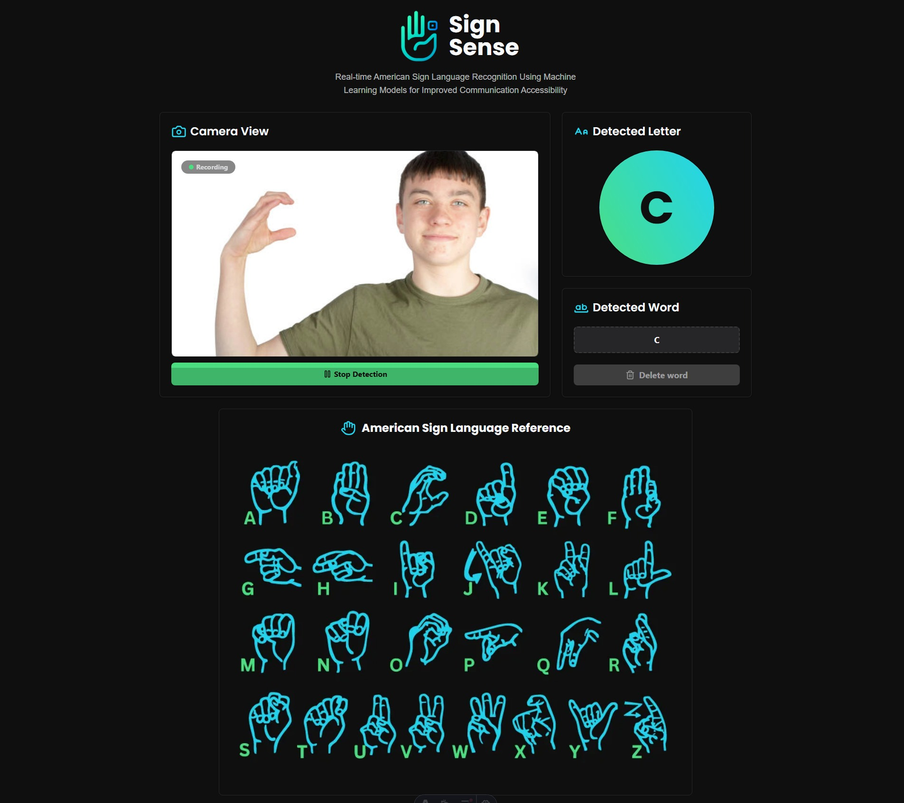

# SignSense 🤟

A real-time sign language recognition web application that uses machine learning to detect and classify American Sign Language (ASL) alphabet letters through camera input.



## 🚀 Features

- **Real-time detection**: Instant recognition of American Sign Language alphabet letters
- **Modern web interface**: Frontend built with Astro and TypeScript
- **Machine Learning**: Trained model with multiple algorithms (SVM, Random Forest, etc.)
- **WebSocket**: Real-time communication between frontend and backend
- **High accuracy**: Model achieves 95% accuracy on test dataset

## 🏗️ Architecture

### Frontend
- **Framework**: Astro with TypeScript

### Backend
- **Image processing**: MediaPipe for hand landmark detection
- **Machine Learning**: Trained models for letter classification
- **WebSocket**: Server for real-time communication

### ML Model
- **Extracted features**:
  - Distances between hand key points
  - Angles between landmarks
  - Convex hull area
  - Hand orientation
  - Extended fingers count
  - Bounding box features

## 📊 Model Performance

The model achieves **95% accuracy** on the test dataset, with excellent performance across most alphabet letters

## 🛠️ Installation

### Prerequisites
- Docker
- Webcam

### Build
```bash
docker-compose build
```

### Start the container
```bash
docker-compose up
```

## 🎯 Usage

1. **Start the application**: Run both frontend and backend
2. **Allow camera access**: Browser will request permissions
3. **Begin detection**: Click "Start Detection" 
4. **Make signs**: Show ASL alphabet letters in front of the camera
5. **View predictions**: Detected letters will appear in real-time

## 🔧 Technical Features

### Video Capture
- Resolution: 800x600 pixels 
- Format: WebM with VP9 codec
- Bitrate: 2.5 Mbps
- Send interval: 200ms 

### Processing
- **Landmark extraction**: MediaPipe Hands
- **Normalization**: Landmarks normalized relative to wrist
- **Features**: 21 hand key points processed

### Communication
- **WebSocket**: Persistent connection for video streaming
- **Auto-reconnection**: Retry every 5 seconds
- **Error handling**: Robust camera error management

## 📁 Project Structure

```
SignSense/
├── app/
│   ├── frontend/          # Astro web application
│   │   ├── src/
│   │   │   ├── components/
│   │   │   └── lib/
│   ├── backend/           # Python server
│   └── sketch/           # Training notebooks
│       └── main.ipynb    # Model analysis and training
```

## 📝 License

This project is licensed under the MIT License - see the [LICENSE](LICENSE) file for details.

## 🙏 Acknowledgments

- MediaPipe for hand landmark detection
- Astro for the frontend framework
- ASL community for educational resources